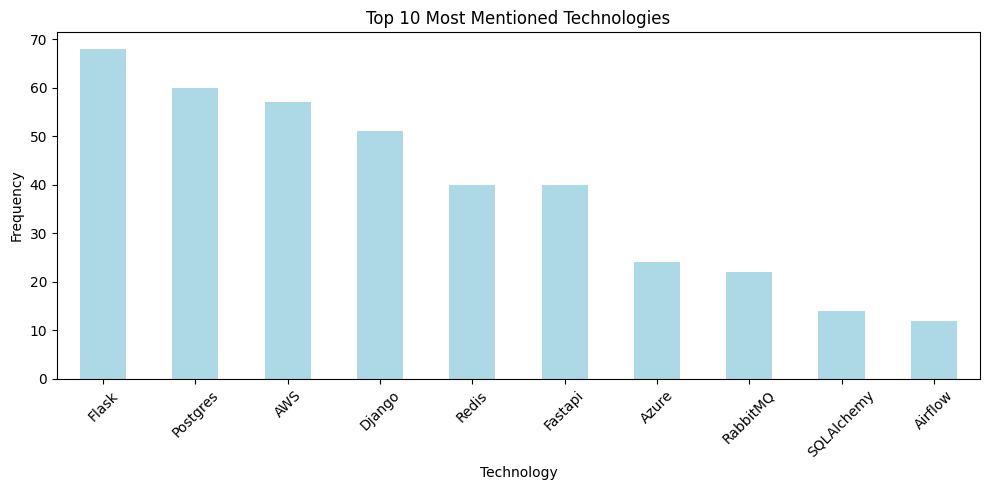
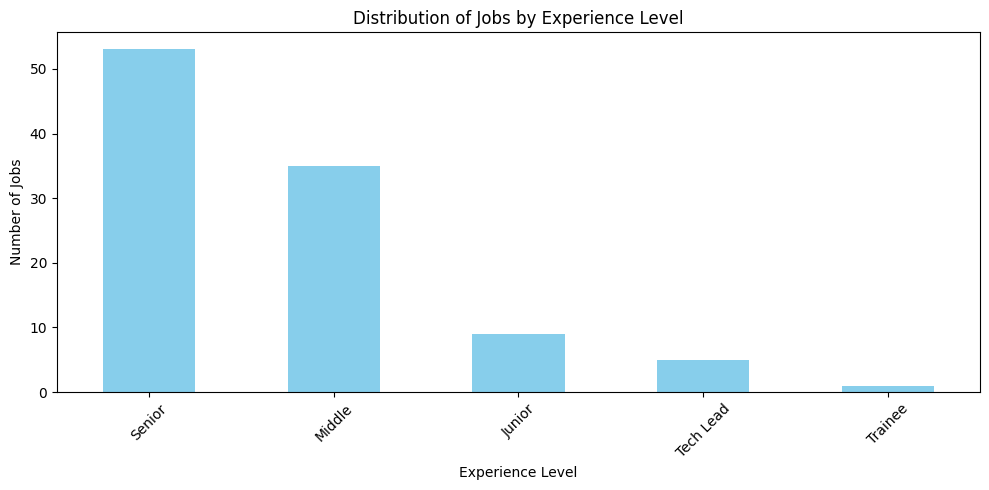
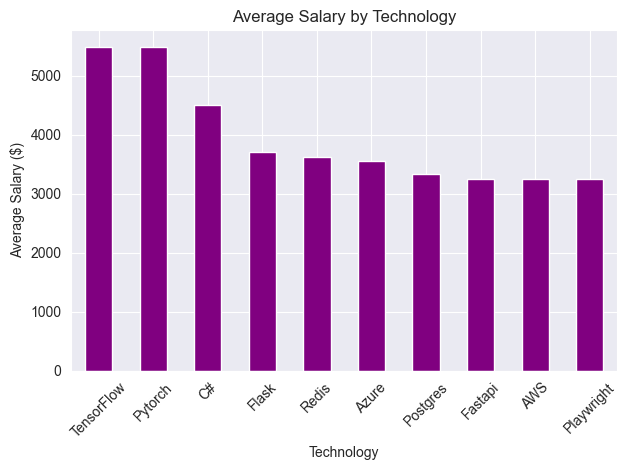
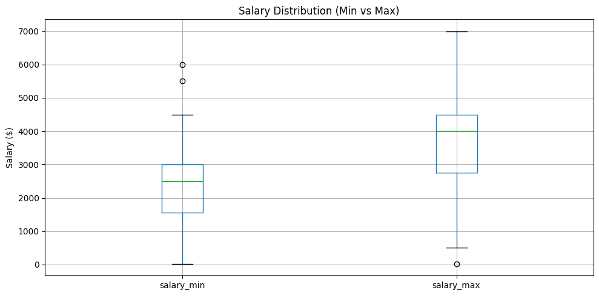
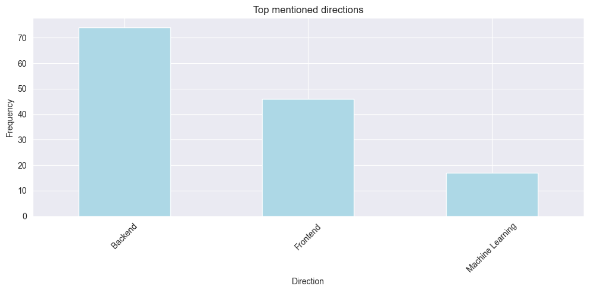
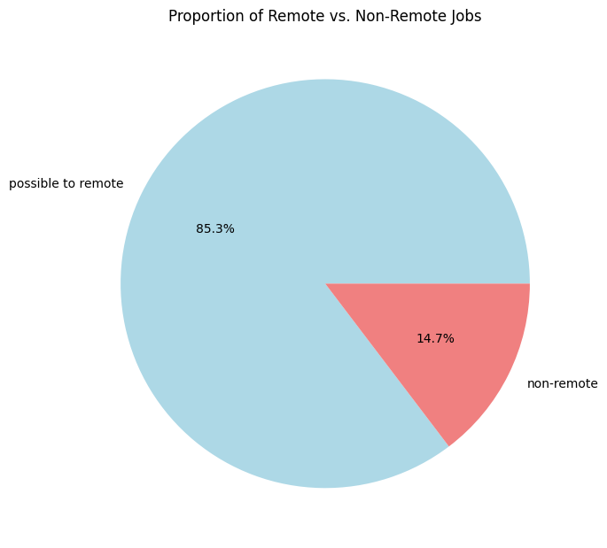

# Data Scraping and Analysis of job data on python jobs.dou.ua
## Project Description

This project focuses on extracting job vacancy data from a website, analyzing the information, and presenting key details such as salary ranges, required experience, and common skills. The goal is to provide insights into trends and demands in the Python job market.
## Installing using GitHub:

```bash
git clone https://github.com/necobra/technologies-stats
cd technologies-stats  
python -m venv venv  
source venv/bin/activate  
pip install -r requirements.txt  
```

## Usage
### Run the Scraping Script
This script will scrape job vacancy data and save it to vacancies.csv.

```bash
python scraper/scraper.py
```
### Run the Analysis Script
This script will load the vacancies.csv file, perform data cleaning and analysis, and generate visualizations.

```bash
jupyter notebook analysis/main.ipynb
```

### Config
If needed, you can change the configuration in config.py. For example, you can change the query parameter it uses to search and/or which technologies to search for.

# Examples:
### Top technologies


### Distribution of jobs by experience level


### Avarage salary by mentioned technology


### Salary Distribution(Min vs Max)


### Top mentioned key words


### Proportion of remote vs. non-remote jobs

